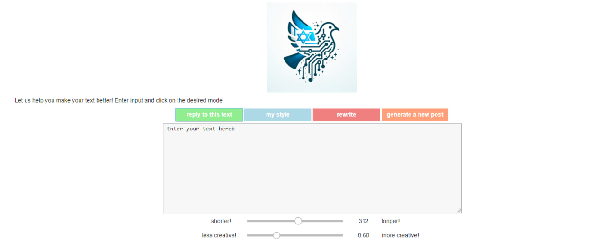

<table>
  <tr>
    <td>
      
    </td>
  </tr>
</table> 

# Project Title: Intelligent Interactive System - Final Design Project : SpeechUp

## Description

n this project, we aim to address a particularly timely issue - Israeli advocacy and responding to expressions of antisemitism on social media. Our system will enable various users, regardless of their level of articulation, language barriers, and experience, to create high-quality and relevant texts that increase exposure to Israeli advocacy. The solution we propose is an intelligent system that supports a variety of functions, including:

## Features
- **Reply to Text**: Given anti-Israeli text, it can generate a responsive text.
- **My Style**: Given a user's previous post, it can generate new text inspired by your content while maintaining elements unique to you.
- **Rewrite**: Given your initial version, it can rewrite and create a quality, correct post.
- **Generate New Post**: It can create entirely new text.
The system is based on an LLM capable of generating interesting and clear text, and on a dataset we created by scanning Reddit. The unique element of the system is its focus on a specific issue - pro-Israeli posts on social media. While similar solutions exist in other sectors, they are aimed at the business sector, do not allow expressing the user's personal style, and avoid discussion on sensitive topics like this one.

<table>
  <tr>
    <td>
      
    </td>
  </tr>
</table> 

## Installation

```bash
pip install praw nltk openai ipywidgets pandas

To run the project, open the file via jupyter notebook. 
to insert API key edit the following code line in the 9th cell:
os.environ["OPENAI_API_KEY"] = "YourKeyHere"
run all cells except the last one. 
once you are finished generating several inputs, run the last cell to view history. 
